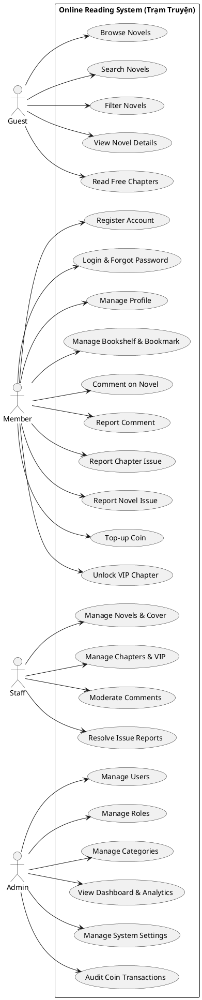

# SWP391 PROJECT SPECIFICATION
# Trạm Truyện – Nền tảng đọc truyện chữ trực tuyến

> **Course:** SWP391 – Software Development Project  
> **Team size:** 5 members  
> **Architecture:** MVC + Multi-layer Architecture  
> **Backend:** Java 17/21 + Spring Boot 3.x  
> **Frontend:** Thymeleaf + HTML/CSS/JavaScript + Tailwind CSS  
> **Database:** PostgreSQL  
> **Source Control:** Git + GitHub  
> **Deployment:** Docker / Docker Compose  
> **Image Storage:** Cloudinary  
> **Chapter Content:** PostgreSQL TEXT  
> **Security:** Spring Security + HTTP Session

---

# 1. PROJECT OVERVIEW

## 1.1. Project Name

**Trạm Truyện**

Hệ thống là nền tảng đọc truyện chữ trực tuyến, tập trung vào trải nghiệm đọc mượt mà, nội dung do ban quản trị trực tiếp đăng tải và phát hành.

Hệ thống hỗ trợ:

- Khách truy cập đọc truyện miễn phí, tìm kiếm và gửi liên hệ.
- Member đăng ký và quản lý tài khoản, lưu truyện vào tủ sách, lưu bookmark tiến độ đọc.
- Member bình luận, gửi báo lỗi chương và báo cáo vi phạm bộ truyện.
- Member nạp Coin vào ví qua cổng thanh toán để mở khóa đọc các chương VIP vĩnh viễn (không hoàn tiền, không rút tiền).
- Staff biên tập nội dung, đăng tải truyện, xuất bản chương, gắn thẻ VIP, xử lý báo lỗi và kiểm duyệt bình luận.
- Admin quản lý người dùng, phân quyền role, quản lý thể loại, tiếp nhận & xử lý báo cáo vi phạm, đối soát giao dịch nạp Coin và cấu hình hệ thống.

---

# 2. SWP391 COMPLIANCE

Project được thiết kế để đáp ứng các yêu cầu chính của SWP391.

Theo tài liệu môn học:

- Team gồm 4–6 sinh viên, ưu tiên 5 sinh viên.
- Project cần có scope đủ lớn, khoảng **1800–3600 LOC**.
- Mỗi software function được đánh giá theo độ phức tạp simple/medium/complex tương ứng 60/120/240 LOC.
- Assessment 1 yêu cầu SRS ≥15 trang, ≥12 user stories, ERD ≥8 entities, state diagram, architecture và UI.
- Assessment 2 yêu cầu SDS ≥15 trang, ≥12 sequence diagrams, Workflow 0/1/2, MVC/multi-layer, CRUD, database ≥10 tables và ≥8 commits/member.
- Assessment 3 yêu cầu tích hợp workflow, ≥25 test cases và ≥80% test passed.
- GitHub được sử dụng làm bằng chứng về source code, process và contribution.

---

# 3. TECHNOLOGY STACK

## 3.1. Backend

```text
Java 17/21
Spring Boot 3.x
Spring MVC
Spring Data JPA
Hibernate
Spring Security
Thymeleaf
```

## 3.2. Frontend

```text
HTML5
CSS3
JavaScript
Tailwind CSS
Thymeleaf
```

Không sử dụng SPA/REST API ở phiên bản chính.

Mô hình chính:

```text
Browser
   ↓
Spring MVC Controller
   ↓
Service
   ↓
Repository
   ↓
PostgreSQL
```

---

# 4. ARCHITECTURE

## 4.1. Multi-layer MVC Architecture

```text
┌─────────────────────────────┐
│        Presentation         │
│  Thymeleaf + HTML/CSS/JS    │
└──────────────┬──────────────┘
               ↓
┌─────────────────────────────┐
│         Controller          │
│       Spring MVC            │
└──────────────┬──────────────┘
               ↓
┌─────────────────────────────┐
│      Service / Business     │
│       ServiceImpl           │
└──────────────┬──────────────┘
               ↓
┌─────────────────────────────┐
│         Repository          │
│       Spring Data JPA       │
└──────────────┬──────────────┘
               ↓
┌─────────────────────────────┐
│          Entity             │
│       JPA / Hibernate       │
└──────────────┬──────────────┘
               ↓
┌─────────────────────────────┐
│        PostgreSQL           │
└─────────────────────────────┘
```

Kiến trúc này phù hợp với yêu cầu Codebase & Database của SWP391 về **multi-layer design, ví dụ MVC**, CRUD classes và database có đầy đủ PK/FK.

---

# 5. PROJECT SCOPE

## 5.1. Main Actors

| Actor | Responsibility |
|---|---|
| Guest | Duyệt truyện, tìm kiếm nâng cao, đọc chương miễn phí, gửi liên hệ, đăng ký tài khoản, kích hoạt email OTP, đăng nhập Google OAuth2 |
| Member | Đọc truyện, tùy chỉnh giao diện đọc, lưu tủ sách, bookmark & tiến độ đọc, đánh giá sao & nhận xét truyện, bình luận, báo lỗi chương/truyện, nạp Coin qua VNPay mở khóa chương VIP (không hoàn tiền, không rút tiền) |
| Staff | Đăng tải truyện mới, biên tập chương, gắn thẻ VIP, sửa lỗi nội dung, xử lý báo lỗi chương/truyện và kiểm duyệt bình luận |
| Admin | Quản lý user, role, category, cấu hình hệ thống (tỷ giá Coin, liên hệ, chính sách), tiếp nhận & xử lý báo cáo vi phạm, đối soát giao dịch nạp Coin |

---

# 6. DATABASE DESIGN

Mục tiêu database:

**≥10 tables**, normalized, đầy đủ PK/FK theo yêu cầu SWP391.

## 6.1. Proposed Tables

```text
1. roles
2. users
3. user_roles
4. password_reset_tokens
5. email_verification_tokens
6. categories
7. novels
8. novel_categories
9. novel_ratings
10. chapters
11. bookshelves
12. user_read_chapters
13. reading_progress
14. unlocked_chapters
15. comments
16. comment_reports
17. chapter_reports
18. novel_reports
19. transactions
20. system_settings
```

Hệ thống gồm đúng **20 tables** chuẩn hóa, đầy đủ PK/FK và quan hệ ràng buộc chặt chẽ.

---

# 7. FUNCTION ALLOCATION

Team gồm **5 members**.

Mục tiêu phân công:

> Mỗi member phụ trách **10–13 business functions** theo quy trình liền mạch và Actor rõ ràng.

Tổng:

```text
Member 1: 10 functions (Novel & Chapter CMS)
Member 2: 10 functions (Reader Experience, Bookshelf & VIP Unlock)
Member 3: 11 functions (Auth, Security, OAuth2 & VNPay Payment)
Member 4: 10 functions (Category, Search Specification & Novel Rating)
Member 5: 12 functions (Community, Reports, Notifications & User Admin)

Total = 53 tracked functions
```

**Lưu ý quan trọng:** 53 tracked functions tuân thủ nguyên tắc Single Responsibility (mỗi chức năng giải quyết đúng 1 nghiệp vụ rõ ràng, không gộp lẫn).

SWP391 đánh giá LOC theo độ phức tạp của function:

```text
Simple   = 60 LOC
Medium   = 120 LOC
Complex  = 240 LOC
```

và code quality có thể làm mức LOC được tính còn 100%, 75% hoặc 50%.

Do đó project vẫn phải kiểm soát tổng scope trong khoảng:

```text
1800–3600 LOC
```

53 functions ở đây dùng để **chia workload đều cho 5 sinh viên và tracking contribution trên GitHub**.

---

# 8. MEMBER 1 – NOVEL & CHAPTER CMS

## Functions

| ID | Function | Actor |
|---|---|---|
| M1-F01 | Create Novel | Staff, Admin |
| M1-F02 | Update Novel | Staff, Admin |
| M1-F03 | Archive Novel | Staff, Admin |
| M1-F04 | Delete Novel | Admin |
| M1-F05 | View Internal Novels | Staff, Admin |
| M1-F06 | Create Chapter | Staff, Admin |
| M1-F07 | Update Chapter | Staff, Admin |
| M1-F08 | Hide Chapter | Staff, Admin |
| M1-F09 | Delete Chapter | Staff, Admin |
| M1-F10 | Configure Chapter | Staff, Admin |

## Main Responsibility

```text
Novel CRUD & Metadata (Staff/Admin)
Novel Cover & Status Management (Archive vs Soft Delete)
Internal Novels Admin Dashboard (CMS)
Chapter CRUD (Create, Update, Hide, Soft Delete)
Chapter Visibility & VIP Pricing Configuration
```

## Main Classes

```text
NovelAdminController
ChapterAdminController
NovelService
ChapterService
NovelServiceImpl
ChapterServiceImpl
NovelRepository
ChapterRepository
Novel
Chapter
```

---

# 9. MEMBER 2 – READER EXPERIENCE, BOOKSHELF & VIP UNLOCK

## Functions

| ID | Function | Actor |
|---|---|---|
| M2-F01 | View Novels | Guest, Member |
| M2-F02 | View Novel Details | Guest, Member |
| M2-F03 | Read Chapter | Guest, Member |
| M2-F04 | Customize Reader | Guest, Member |
| M2-F05 | Save Reading Progress | Member |
| M2-F06 | Add Novel to Bookshelf | Member |
| M2-F07 | View Bookshelf | Member |
| M2-F08 | Remove Novel from Bookshelf | Member |
| M2-F09 | Unlock Chapter | Member |
| M2-F10 | View Reading History | Member |

## Main Responsibility

```text
Public Novel & Chapter Catalog (Guest & Member)
Reader UI Engine & Mark Read Chapters (is_read)
Reader Display Customization (Font size, themes, scroll mode)
Reading Progress Percentage & Bookmark ("Đọc tiếp")
Personal Bookshelf Management (Add, View, Remove)
VIP Chapter Unlock with Coin (Concurrency check, wallet deduction)
Unlocked Reading History
```

## Main Classes

```text
NovelController
ReaderController
BookshelfController
ReaderService
BookshelfService
VIPUnlockService
ReaderServiceImpl
BookshelfServiceImpl
VIPUnlockServiceImpl
BookshelfRepository
ReadingProgressRepository
UserReadChapterRepository
UnlockedChapterRepository
Bookshelf
ReadingProgress
UserReadChapter
UnlockedChapter
```

---

# 10. MEMBER 3 – AUTH, SECURITY, OAUTH2 & PAYMENT

## Functions

| ID | Function | Actor |
|---|---|---|
| M3-F01 | Register Account | Guest |
| M3-F02 | Verify Account | Guest |
| M3-F03 | Login | Guest |
| M3-F04 | Login with Google | Guest |
| M3-F05 | Logout | Member, Staff, Admin |
| M3-F06 | Reset Password | Guest |
| M3-F07 | Change Password | Member, Staff, Admin |
| M3-F08 | View Profile | Member, Staff, Admin |
| M3-F09 | View Coin History | Member, Staff, Admin |
| M3-F10 | Update Profile | Member, Staff, Admin |
| M3-F11 | Top-up Coin | Member |

## Main Responsibility

```text
Authentication & Session Management (Form Login + Remember Me)
Email OTP Account Verification (JavaMailSender, Async, Token expiry)
Social Login (Spring Security OAuth2 Client - Google Login)
Password Reset Token Workflow with Email
Profile & Avatar Cloudinary Upload
VNPay Payment Gateway Integration (HMAC-SHA512, Checksum, IPN Webhook)
Coin Transaction History (Top-up and Spend)
```

## Main Classes

```text
AuthController
OAuth2Controller
ProfileController
PaymentGatewayController
AuthService
EmailService
OAuth2Service
UserService
PaymentGatewayService
AuthServiceImpl
EmailServiceImpl
OAuth2ServiceImpl
UserServiceImpl
PaymentGatewayServiceImpl
UserRepository
RoleRepository
PasswordResetTokenRepository
EmailVerificationTokenRepository
TransactionRepository
User
Role
PasswordResetToken
EmailVerificationToken
Transaction
```

---

# 11. MEMBER 4 – CATEGORY, SEARCH SPECIFICATION & NOVEL RATING

## Functions

| ID | Function | Actor |
|---|---|---|
| M4-F01 | Create Category | Admin |
| M4-F02 | View Categories | Guest, Member, Staff, Admin |
| M4-F03 | Update Category | Admin |
| M4-F04 | Delete Category | Admin |
| M4-F05 | Categorize Novel | Staff, Admin |
| M4-F06 | Search Novels | Guest, Member |
| M4-F07 | Filter Novels | Guest, Member |
| M4-F08 | Sort Novels | Guest, Member |
| M4-F09 | Review Novel | Member |
| M4-F10 | View Leaderboards | Guest, Member |

## Main Responsibility

```text
Category CRUD & Novel Category Many-to-Many Mapping
Advanced Search Engine with JPA Specification & CriteriaBuilder
Live Search Autocomplete / Quick Suggestion REST API
Novel Category & Status Filter
Multi-attribute Sorting (Latest, Views, Rating, Chapters, A-Z)
Novel Rating & Review System (1-5 stars, composite average calculation)
Top Views Leaderboard (Day, Week, Month, All-time)
```

## Main Classes

```text
CategoryController
SearchController
NovelRatingController
LeaderboardController
CategoryService
SearchService
NovelRatingService
LeaderboardService
CategoryServiceImpl
SearchServiceImpl
NovelRatingServiceImpl
LeaderboardServiceImpl
NovelSpecification
CategoryRepository
NovelRatingRepository
NovelRepository
Category
NovelRating
```

---

# 12. MEMBER 5 – COMMUNITY, REPORTS & FINANCIAL ADMIN

### Member 5 (Community, Reports, Notifications & User Admin)

| ID | Function | Actor |
|---|---|---|
| M5-F01 | Create Comment | Member |
| M5-F02 | View Comments | Guest, Member |
| M5-F03 | Report Comment | Member |
| M5-F04 | Report Content | Member |
| M5-F05 | Resolve Reports | Staff, Admin |
| M5-F06 | Send Notification | Staff, Admin |
| M5-F07 | View Mailbox | Member |
| M5-F08 | Audit Transactions | Admin |
| M5-F09 | Configure System | Admin |
| M5-F10 | View User List | Admin |
| M5-F11 | Assign Roles | Admin |
| M5-F12 | Ban/Enable User | Admin |

## Main Responsibility

```text
Community Comment System & Paginated Comment List
Comment Toxicity Reporting & Content Moderation
Chapter Issue Reports & Content Correction Workflow
Novel Violation Report Processing
System Financial Audit & Coin Flow Reconcile
Global System Configuration (Coin Rate, Hotline, Email, Policy)
Notification System
User Account Management
```

## Main Classes

```text
CommentController
ReportController
NotificationController
AdminFinanceController
UserAdminController
CommentService
ReportService
NotificationService
AdminFinanceService
UserService
CommentServiceImpl
ReportServiceImpl
NotificationServiceImpl
AdminFinanceServiceImpl
UserServiceImpl
CommentRepository
CommentReportRepository
ReportRepository
NotificationRepository
TransactionRepository
SystemSettingRepository
UserRepository
RoleRepository
Comment
CommentReport
ContentReport
Notification
SystemSetting
User
Role
```

---

# 13. USE CASE MODEL

Mục tiêu khoảng:

**20–25 use cases**

Không nên biến tất cả 53 functions thành 53 use cases.

---

## 13.1. Guest Use Cases

```text
UC01 Browse Novels
UC02 Search Novels
UC03 Filter Novels
UC04 View Novel Details
UC05 Read Free Chapters
```

---

## 13.2. Member Use Cases

```text
UC07 Register Account
UC08 Login & Forgot Password
UC09 Manage Profile
UC10 Manage Bookshelf & Bookmark
UC11 Comment on Novel
UC11b Report Comment
UC12 Report Chapter Issue
UC12b Report Novel Issue
UC13 Top-up Coin (VNPay/Momo)
UC14 Unlock VIP Chapter with Coin
```

---

## 13.3. Staff Use Cases

```text
UC15 Manage Novels & Upload Cover
UC16 Manage Chapters & VIP Pricing
UC17 Moderate Comments
UC18 Resolve Chapter & Novel Reports
```

---

## 13.4. Admin Use Cases

```text
UC19 Manage Users
UC20 Manage Roles
UC21 Manage Categories
UC22 View Dashboard & Novel Analytics
UC23 Manage System Settings
UC24 Audit Coin Transactions
```

Use case naming nên sử dụng dạng **Verb + Object**, phù hợp với cấu trúc RDS template.

---

# 14. USE CASE DIAGRAM

Có thể sử dụng PlantUML:



---

# 15. SDS REQUIREMENTS

Theo SDS template, mỗi feature chính cần mô tả:

```text
1. Class Diagram
2. Class Specifications
3. Sequence Diagram
4. Database Queries
```

SDS tổng thể nên đạt:

**≥15 pages**

và:

**≥12 sequence diagrams**

theo Assessment 2.

Mục tiêu project:

```text
18 Sequence Diagrams
```

để có buffer an toàn.

---

# 16. PROPOSED SEQUENCE DIAGRAMS

```text
SD01 Register
SD02 Login
SD03 Update Profile

SD04 Create Novel (Staff)
SD05 Update Novel & Cover (Staff)
SD06 Archive/Delete Novel (Staff/Admin)
SD07 Process Novel Report (Staff/Admin)

SD08 Create Chapter (Staff)
SD09 Update Chapter & VIP Pricing (Staff)
SD10 Read Chapter & Mark Read
SD11 Save Reading Progress & Bookmark
SD12 Top-up Coin (VNPay/Momo)
SD13 Unlock VIP Chapter with Coin

SD14 Search & Filter Novels
SD15 Manage Category (Admin)

SD16 Manage Bookshelf
SD17 Create Comment & Report Comment
SD18 Report Chapter Issue & Resolve
```

Có thể bổ sung sequence diagram cho Admin Dashboard hoặc User Management nếu cần tăng độ đầy đủ của SDS.

---

# 17. CLASS DESIGN

Mỗi feature phải có thiết kế class trước khi code.

Ví dụ:

```text
NovelController
       |
       ↓
NovelService
       |
       ↓
NovelServiceImpl
       |
       ↓
NovelRepository
       |
       ↓
Novel
```

Không nên đặt toàn bộ business logic trong Controller.

---

# 18. PACKAGE STRUCTURE

Đề xuất:

```text
com.tramtruyen
│
├── config
│
├── controller
│   ├── AuthController
│   ├── NovelController
│   ├── ChapterController
│   ├── CategoryController
│   ├── BookshelfController
│   ├── CommentController
│   └── ReportController
│
├── service
│   ├── AuthService
│   ├── UserService
│   ├── NovelService
│   ├── ChapterService
│   ├── CategoryService
│   ├── BookshelfService
│   ├── CommentService
│   └── ReportService
│
├── repository
│
├── entity
│
├── dto
│
├── security
│
├── exception
│
└── util
```

---

# 19. SECURITY

Sử dụng:

```text
Spring Security
Form Login
HTTP Session
Role-based Authorization
```

Roles:

```text
ROLE_ADMIN
ROLE_STAFF
ROLE_MEMBER
```

Guest không cần authentication.

Ví dụ:

```text
/admin/**       → ADMIN
/staff/**       → ADMIN, STAFF
/member/**      → MEMBER, STAFF, ADMIN
/public/**      → Guest
```

---

# 20. NOVEL & VIP CHAPTER PUBLISHING WORKFLOW

## Workflow 1 – Staff Novel & Chapter Publishing

```text
Staff / Admin
  ↓
Create Novel (Title, Original Author, Description)
  ↓
Upload Novel Cover (Cloudinary)
  ↓
Assign Categories
  ↓
Create Chapter (Number, Title, Text Content)
  ↓
Set Chapter Visibility (Regular Free / VIP Coin Price)
  ↓
Publish Novel & Chapters (Live on website)
```

### Exception Path 1

```text
Invalid cover image / text formatting
        ↓
Display validation error
        ↓
Staff corrects information
```

### Exception Path 2

```text
Novel reported or requested for takedown
        ↓
Admin/Staff changes status to ARCHIVED
        ↓
Novel hidden from public catalog
```

---

# 21. READING & VIP UNLOCK WORKFLOW

## Workflow 2 – Reading, Bookmark & VIP Unlock

```text
Guest / Member
     ↓
Search / Browse Novel
     ↓
View Novel Details & Chapter List
     ↓
Select Chapter to Read
     ↓
Check Chapter Type (Regular vs VIP)
     ↓
[If VIP & Not Unlocked]
  ├── Insufficient Coin → Prompt Top-up Coin via VNPay/Momo
  └── Sufficient Coin → Deduct Coin & Unlock Chapter Permanently
     ↓
Read Chapter Content
     ↓
System auto-marks Read & Updates Bookmark Progress
     ↓
Add to Bookshelf / Comment / Report Chapter Issue
```

### Exception Path 1

```text
Insufficient Coin balance for VIP chapter
        ↓
Prompt modal with price details
        ↓
Redirect to Coin Top-up Page (VNPay/Momo)
```

### Exception Path 2

```text
Chapter is currently Draft / Hidden
        ↓
Display notice: "Chương đang cập nhật"
        ↓
Redirect to Novel Details page
```

---


# 22. WORKFLOW 0 – DATA INITIALIZATION

Workflow 0 được dùng để chuẩn bị dữ liệu ban đầu:

```text
Admin Login
   ↓
Create Categories
   ↓
Create Staff Account
   ↓
Create/Import Initial Novels
   ↓
Create Chapters
   ↓
Verify Database
```

Workflow 0 + Workflow 1 + Workflow 2 phải được tích hợp để đáp ứng yêu cầu Assessment 2.

---

# 23. ITERATION PLAN

SWP391 sử dụng Construction phase với các iteration để xây dựng software package và documentation.

## Iteration 1 – Foundation

### Main objectives

```text
Project setup
Database
Entity
Authentication
Basic UI
Novel CRUD
Category CRUD
```

### Members

```text
M1 → Novel foundation
M2 → Chapter foundation
M3 → Authentication
M4 → Category
M5 → Bookshelf foundation
```

Deliverables:

```text
Integrated code
SRS
SDS for Iteration 1
Database script
GitHub repository
Weekly report
```

---

# 24. ITERATION 2 – CORE BUSINESS WORKFLOW

Focus:

```text
Novel submission
Novel approval
Chapter management
Reading
Search
User roles
```

Main goal:

```text
Workflow 0
+
Workflow 1
+
Workflow 2 main flow
```

Đây là iteration quan trọng cho Assessment 2.

---

# 25. ITERATION 3 – INTERACTION & INTEGRATION

Focus:

```text
Bookshelf
Reading history
Comment
Report issue
Moderation
Dashboard
Exception paths
Testing
```

Main goal:

```text
All workflows integrated
+
Exception handling
+
Testing
+
UI finalization
```

---

# 26. TESTING REQUIREMENTS

Assessment 3 yêu cầu:

```text
≥25 test cases
≥80% passed
Full coverage
AI + Manual testing
```


Project target:

```text
30–40 test cases
```

Phân bổ đề xuất:

| Module | Test Cases |
|---|---:|
| Authentication | 5 |
| Novel | 6 |
| Chapter | 5 |
| Search/Category | 4 |
| Bookshelf/History | 4 |
| Comment/Report | 4 |
| Authorization | 3 |
| **Total** | **31** |

---

# 27. AI USAGE

AI được sử dụng có kiểm soát cho:

```text
Requirement analysis
User story refinement
UML modeling
Database design suggestions
Code generation assistance
Debugging
Test case generation
Documentation review
```

Không được xem AI output là automatically correct.

Quy trình:

```text
AI Suggestion
      ↓
Developer Review
      ↓
Compare with Requirement
      ↓
Implement
      ↓
Test
      ↓
Validate
```

Final evaluation có **AI Usage and Professionalism 20%**, bao gồm transparency, responsible AI usage, logs, reports và validation AI output.

---

# 28. GITHUB WORKFLOW

## 28.1. Repository

Project sử dụng:

```text
GitHub Repository
```

Ví dụ:

```text
tram-truyen-swp391
```

Repository nên chứa:

```text
/src
/database
/docs
/plantuml
/tests
/README.md
/docker-compose.yml
/.gitignore
```

---

# 29. GITHUB BRANCH STRATEGY

Không cho các member code trực tiếp trên `main`.

Đề xuất:

```text
main
│
├── develop
│
├── feature/member1-novel
├── feature/member2-chapter
├── feature/member3-auth
├── feature/member4-search
└── feature/member5-interaction
```

Hoặc chia branch nhỏ hơn theo function:

```text
feature/M1-F01-create-novel
feature/M1-F07-create-chapter
feature/M2-F01-view-novel-list
feature/M2-F04-read-chapter
feature/M3-F01-register
...
```

Đối với project 5 thành viên, cách thứ hai giúp lecturer dễ xác định contribution của từng member.

---

# 30. GITHUB ISSUE MANAGEMENT

Mỗi function được tạo thành một Issue.

Ví dụ:

```text
[M1-F01] Create Novel
[M1-F07] Create Chapter

[M2-F01] View Novel List
[M2-F04] Read Chapter & Mark Read

[M3-F01] Register
[M3-F02] Login
```

Issue nên có:

```text
Function ID
Description
Acceptance Criteria
Assigned Member
Priority
Iteration
Status
Related Use Case
Related Sequence Diagram
```

---

# 31. GITHUB PROJECT BOARD

Sử dụng GitHub Projects để tracking:

```text
Backlog
     ↓
To Do
     ↓
In Progress
     ↓
Code Review
     ↓
Testing
     ↓
Done
```

Mỗi Issue/function được liên kết với Project Board.

Ví dụ:

```text
[M1-F01] Create Novel

Iteration: Iteration 1
Member: Member 1
Use Case: UC13
Sequence: SD04
Status: Code Review
```

Điều này giúp chứng minh **task tracking và individual contribution**.

---

# 32. PULL REQUEST WORKFLOW

Mỗi member không merge code trực tiếp vào `main`.

Quy trình:

```text
Issue
  ↓
Create Feature Branch
  ↓
Code
  ↓
Commit
  ↓
Push GitHub
  ↓
Create Pull Request
  ↓
Code Review
  ↓
Testing
  ↓
Merge
```

Ví dụ:

```text
Issue:
[M1-F01] Create Novel

Branch:
feature/M1-F01-create-novel

PR:
[M1-F01] Implement Create Novel
```

---

# 33. COMMIT CONVENTION

Đề xuất:

```text
feat: implement novel creation
feat: add chapter validation
fix: fix duplicate chapter number
fix: resolve login session issue
refactor: improve novel service
test: add novel service tests
docs: update SDS sequence diagram
```

Có thể thêm Function ID:

```text
feat(M1-F01): implement create novel
fix(M1-F08): validate duplicate chapter number
test(M3-F01): add registration tests
docs(M4-F08): update search sequence diagram
```

Cách này giúp lecturer dễ truy xuất contribution.

---

# 34. GITHUB CONTRIBUTION REQUIREMENT

Assessment 2 yêu cầu:

```text
≥8 commits/member
```

và có AI debugging logs.

Team nên đặt target cao hơn:

```text
≥15 meaningful commits/member
```

Không nên tạo commit giả chỉ để tăng số lượng.

Một commit nên đại diện cho một thay đổi có ý nghĩa.

Ví dụ tốt:

```text
feat(M1-F01): implement novel creation
test(M1-F01): add validation tests
fix(M1-F01): fix empty title validation
```

Ví dụ không tốt:

```text
update
test
aaa
fix
update2
```

---

# 35. GITHUB RELEASE / TAG

Các submission quan trọng phải được baseline/tag.

Vì tài liệu SWP391 yêu cầu các submission được baseline/tagged trong Git workflow.

Với GitHub, sử dụng Git tag/Release:

```text
v0.1-iter1
v0.2-iter2
v0.3-iter3
v1.0-final
```

Ví dụ:

```text
v0.1-iter1
→ Iteration 1 submission

v0.2-iter2
→ Assessment 2

v0.3-iter3
→ Assessment 3

v1.0-final
→ Final submission
```

---

# 36. GITHUB DOCUMENTATION STRUCTURE

Repository:

```text
tram-truyen-swp391/
│
├── README.md
│
├── docs/
│   ├── SRS/
│   ├── SDS/
│   ├── Architecture/
│   ├── Database/
│   ├── UML/
│   ├── Testing/
│   └── AI-Logs/
│
├── plantuml/
│   ├── usecase/
│   ├── class/
│   ├── sequence/
│   ├── activity/
│   └── state/
│
├── database/
│   ├── schema.sql
│   └── seed.sql
│
├── src/
│
├── tests/
│
└── docker-compose.yml
```

---

# 37. GITHUB README

README nên có:

```text
1. Project Introduction
2. Features
3. Technology Stack
4. Architecture
5. Database
6. Installation
7. Running Instructions
8. Default Accounts
9. Project Team
10. Branch Strategy
11. Development Workflow
12. Test Information
```

---

# 38. INDIVIDUAL CONTRIBUTION TRACKING

Mỗi member có:

```text
Function IDs
GitHub Issues
Branches
Commits
Pull Requests
Code Reviews
AI Logs
Test Cases
```

Ví dụ Member 1:

```text
M1-F01
M1-F02
...
M1-F11
```

GitHub evidence:

```text
11 Issues
15+ Commits
5+ Pull Requests
Related code
Related tests
AI logs
```

Điều này rất quan trọng vì final evaluation có xét **active contribution**, dựa trên peer review, task tracking và code contribution records.

---

# 39. CODE QUALITY

Code phải tuân thủ:

```text
Java naming convention
Consistent package naming
Meaningful variable names
Meaningful method names
Single Responsibility
OOP principles
Layer separation
Input validation
Exception handling
Avoid duplicated code
```

Student Guide yêu cầu trước khi code phải chuẩn bị detailed design gồm database/classes/sequence và code phải tuân theo coding convention cũng như naming convention đã thống nhất trong SDS.

---

# 40. FUNCTION QUALITY

Không nên tính các thao tác UI quá nhỏ thành function độc lập.

### Không nên

```text
Click Search Button
Open Modal
Display Button
Change CSS
```

### Nên

```text
Search Novel by Keyword
Filter Novel by Category
Submit Novel for Review
Validate Chapter Number
Save Reading Progress
Process Issue Report
```

Function phải có business meaning và có thể giải thích được khi lecturer hỏi.

---

# 41. DEVELOPMENT RULE

Trước khi code một function:

```text
Requirement
   ↓
User Story
   ↓
Use Case
   ↓
Class Design
   ↓
Sequence Diagram
   ↓
Database Design
   ↓
Implementation
   ↓
Self Test
   ↓
Code Review
   ↓
Integration
```

Điều này phù hợp với Student Guide: trước khi coding, member phải chuẩn bị detailed design cho database, classes và sequence; sau đó code, self-test và integrate với các member khác.

---

# 42. GIT/GITHUB TEAM RULE

## Rule 1

Không push trực tiếp vào `main`.

## Rule 2

Mỗi function phải có Issue.

## Rule 3

Mỗi Issue phải có member phụ trách.

## Rule 4

Feature code phải nằm trên feature branch.

## Rule 5

Merge thông qua Pull Request.

## Rule 6

PR phải được test trước khi merge.

## Rule 7

Không commit password/API key/database credential.

## Rule 8

`.env` phải nằm trong `.gitignore`.

## Rule 9

Các milestone phải được tag/release.

## Rule 10

Weekly report phải lưu lại GitHub evidence.

---

# 43. DOCKER

Development environment:

```text
Application
PostgreSQL
```

có thể chạy bằng:

```text
docker compose up
```

Ví dụ:

```text
Browser
   ↓
Spring Boot Application
   ↓
PostgreSQL Container
```

Database script được lưu trong:

```text
/database/schema.sql
/database/seed.sql
```

---

# 44. CLOUDINARY

Cloudinary chỉ dùng cho file/image:

```text
Novel Cover
User Avatar
```

Database lưu:

```text
secure_url
```

Không lưu binary image trực tiếp trong PostgreSQL.

Chapter content vẫn lưu:

```text
PostgreSQL TEXT
```

Ví dụ:

```text
Chapter
├── id
├── novel_id
├── chapter_number
├── title
├── content TEXT
└── status
```

---

# 45. SRS STRUCTURE

SRS nên bao gồm:

```text
1. Introduction
2. Actors
3. System Scope
4. Functional Requirements
5. User Stories
6. Use Case Diagram
7. Detailed Use Cases
8. Business Rules
9. Authorization
10. Screen Flow
11. Screen Description
12. Non-functional Requirements
13. Database Overview
14. Assumptions
15. Constraints
```

Mục tiêu:

```text
≥15 pages
≥12 user stories
```

theo Assessment 1.

---

# 46. SDS STRUCTURE

```text
1. Overview
2. Architecture
3. Package Design
4. Database Design
5. Entity Design
6. Class Diagram
7. Class Specifications
8. Sequence Diagrams
9. Database Queries
10. Security Design
11. Exception Handling
12. Integration Design
```

Mục tiêu:

```text
≥15 pages
≥12 sequence diagrams
```

Theo SDS template, mỗi feature nên có class diagram, class specification, sequence diagram và database queries.

---

# 47. FINAL PRESENTATION

Presentation tối đa:

```text
≤15 slides
```

Nội dung:

```text
1. Project Introduction
2. Team Members
3. Product Overview
4. Use Case Diagram – Guest
5. Use Case Diagram – Member
6. Use Case Diagram – Staff/Admin
7. Package Diagram
8. Database Schema
9. UI Design
10. Workflow 0
11. Workflow 1
12. Workflow 2
13. Testing
14. GitHub / AI / Team Contribution
15. Results & Lessons Learned
```

Student Guide cũng yêu cầu presentation có project introduction, use case diagrams theo role/actor, package diagram, database schema/design, UI design, screen flow và project results.

---

# 48. FINAL PROJECT WORKFLOW

```text
                ┌───────────────┐
                │     Guest     │
                └───────┬───────┘
                        ↓
                 Browse/Search
                        ↓
                 View Novel
                        ↓
                  Read Chapter
                        ↓
               ┌────────────────┐
               │    Member      │
               └───────┬────────┘
                       ↓
              Bookshelf / History
                       ↓
                 Comment / Report
                       ↓
                Top-up Coin & VIP
                       ↓
               ┌────────────────┐
               │     Staff      │
               └───────┬────────┘
                       ↓
               Create Novel & Chapter
                       ↓
               ┌────────────────┐
               │     Admin      │
               └───────┬────────┘
                       ↓
             User / Category / Settings
                        ↓
              Notice & Takedown Claims
```

---

# 49. PROJECT SUCCESS CRITERIA

Project được xem là đạt mục tiêu khi:

## Requirement

```text
SRS ≥15 pages
≥12 user stories
Use cases đầy đủ
Business rules rõ ràng
```

## Design

```text
ERD ≥8 entities
Database ≥10 tables
PK/FK đầy đủ
Normalized database
Valid state diagram
Clear MVC architecture
≥12 sequence diagrams
```

## Implementation

```text
1800–3600 LOC
CRUD hoàn chỉnh
Multi-layer architecture
Integrated workflows
Input validation
Exception handling
```

## Testing

```text
≥25 test cases
≥80% passed
AI + Manual testing
```

## GitHub

```text
≥8 meaningful commits/member
Issues tracked
Feature branches
Pull Requests
GitHub Project tracking
Tags/Releases
Contribution evidence
```

## AI

```text
≥6 AI logs for relevant assessments
10 AI logs for final process evidence
AI output validated by team
No blind copy-paste
```

## Professionalism

```text
Weekly reports
Task tracking
Code review
Team integration
Presentation readiness
```

Các tiêu chí trên được xây dựng từ các mốc Assessment 1–3 và Final Evaluation của SWP391. 
---

# 50. RECOMMENDED PROJECT TARGET

| Item | Target |
|---|---:|
| Team members | 5 |
| Functions | 58 tracked functions |
| Use cases | 20–25 |
| Sequence diagrams | 19 |
| Database tables | 21 |
| User stories | ≥12 |
| SRS | ≥15 pages |
| SDS | ≥15 pages |
| LOC | 1800–3600 |
| Test cases | 30–40 |
| Test pass rate | ≥80% |
| Commits/member | ≥15 recommended |
| AI logs | ≥10 recommended |
| Main workflows | 4 (WF 0, 1, 2, 3) |
| Exception paths | ≥2 / main workflow |
| Git platform | GitHub |

---

# 51. FINAL GITHUB STRUCTURE

```text
tram-truyen-swp391/
│
├── .github/
│   └── workflows/
│
├── docs/
│   ├── SRS/
│   ├── SDS/
│   ├── Architecture/
│   ├── Database/
│   ├── Testing/
│   └── AI-Logs/
│
├── plantuml/
│   ├── usecase/
│   ├── class/
│   ├── sequence/
│   ├── activity/
│   ├── state/
│   └── package/
│
├── database/
│   ├── schema.sql
│   └── seed.sql
│
├── src/
│
├── test/
│
├── docker-compose.yml
├── README.md
└── .gitignore
```

---

# 52. FINAL RECOMMENDATION

Stack cuối cùng:

```text
Java 17/21
        +
Spring Boot 3.x
        +
Spring MVC
        +
Thymeleaf
        +
Spring Security
        +
Spring Data JPA / Hibernate
        +
PostgreSQL
        +
Docker
        +
Cloudinary
        +
GitHub
```

Architecture:

```text
MVC + Multi-layer
```

Team:

```text
5 members
11–13 tracked functions/member
58 tracked functions
```

Project scope:

```text
1800–3600 LOC
```

Database:

```text
21 tables target
```

Main workflows:

```text
Workflow 0 – Data Initialization
Workflow 1 – Staff Novel & VIP Chapter Publishing
Workflow 2 – Reading, Bookmark & VIP Unlock
Workflow 3 – Copyright Notice & Takedown
```

Source control:

```text
GitHub Repository
GitHub Issues
GitHub Projects
Feature Branches
Pull Requests
Git Tags/Releases
```

**Lưu ý:** Tài liệu Student Guide hiện vẫn có những chỗ ghi “GitLab” vì đó là phiên bản hướng dẫn gốc của môn học, trong khi slide SWP391 lại ghi **GitHub** ở phần Tools và yêu cầu minh chứng code history trên GitHub. Vì bạn xác nhận nhóm sử dụng GitHub, bản project này thống nhất phần triển khai thực tế theo **GitHub**, nhưng khi nộp chính thức nên kiểm tra lại với lecturer xem có yêu cầu repository phải nằm trên GitLab hay không. 
