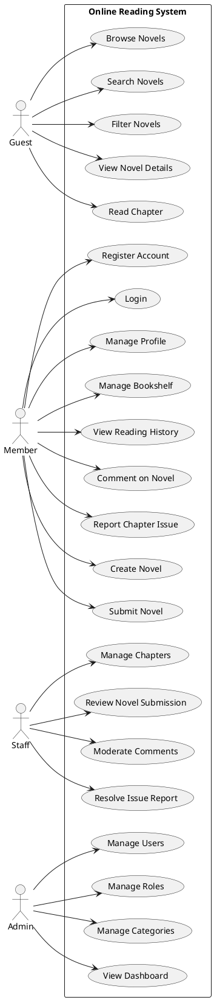

# SWP391 PROJECT SPECIFICATION
# Trạm Truyện – Nền tảng đọc truyện chữ trực tuyến

> **Course:** SWP391 – Software Development Project  
> **Team size:** 5 members  
> **Architecture:** MVC + Multi-layer Architecture  
> **Backend:** Java 17/21 + Spring Boot 3.x  
> **Frontend:** Thymeleaf + HTML/CSS/JavaScript + Tailwind CSS  
> **Database:** PostgreSQL  
> **Source Control:** Git + GitHub  
> **Deployment:** Docker / Docker Compose  
> **Image Storage:** Cloudinary  
> **Chapter Content:** PostgreSQL TEXT  
> **Security:** Spring Security + HTTP Session

---

# 1. PROJECT OVERVIEW

## 1.1. Project Name

**Trạm Truyện**

Hệ thống là nền tảng đọc truyện chữ trực tuyến, có chức năng tương tự các website đọc truyện hiện nay.

Hệ thống hỗ trợ:

- Khách truy cập đọc truyện.
- Member đăng ký và quản lý tài khoản.
- Member lưu truyện vào tủ sách.
- Member theo dõi lịch sử đọc.
- Member bình luận và báo lỗi chương.
- Member có thể đăng truyện.
- Staff kiểm duyệt truyện, chương và bình luận.
- Admin quản lý người dùng, role, category và hệ thống.

---

# 2. SWP391 COMPLIANCE

Project được thiết kế để đáp ứng các yêu cầu chính của SWP391.

Theo tài liệu môn học:

- Team gồm 4–6 sinh viên, ưu tiên 5 sinh viên.
- Project cần có scope đủ lớn, khoảng **1800–3600 LOC**.
- Mỗi software function được đánh giá theo độ phức tạp simple/medium/complex tương ứng 60/120/240 LOC.
- Assessment 1 yêu cầu SRS ≥15 trang, ≥12 user stories, ERD ≥8 entities, state diagram, architecture và UI.
- Assessment 2 yêu cầu SDS ≥15 trang, ≥12 sequence diagrams, Workflow 0/1/2, MVC/multi-layer, CRUD, database ≥10 tables và ≥8 commits/member.
- Assessment 3 yêu cầu tích hợp workflow, ≥25 test cases và ≥80% test passed.
- GitHub được sử dụng làm bằng chứng về source code, process và contribution.

---

# 3. TECHNOLOGY STACK

## 3.1. Backend

```text
Java 17/21
Spring Boot 3.x
Spring MVC
Spring Data JPA
Hibernate
Spring Security
Thymeleaf
```

## 3.2. Frontend

```text
HTML5
CSS3
JavaScript
Tailwind CSS
Thymeleaf
```

Không sử dụng SPA/REST API ở phiên bản chính.

Mô hình chính:

```text
Browser
   ↓
Spring MVC Controller
   ↓
Service
   ↓
Repository
   ↓
PostgreSQL
```

---

# 4. ARCHITECTURE

## 4.1. Multi-layer MVC Architecture

```text
┌─────────────────────────────┐
│        Presentation         │
│  Thymeleaf + HTML/CSS/JS    │
└──────────────┬──────────────┘
               ↓
┌─────────────────────────────┐
│         Controller          │
│       Spring MVC            │
└──────────────┬──────────────┘
               ↓
┌─────────────────────────────┐
│      Service / Business     │
│       ServiceImpl           │
└──────────────┬──────────────┘
               ↓
┌─────────────────────────────┐
│         Repository          │
│       Spring Data JPA       │
└──────────────┬──────────────┘
               ↓
┌─────────────────────────────┐
│          Entity             │
│       JPA / Hibernate       │
└──────────────┬──────────────┘
               ↓
┌─────────────────────────────┐
│        PostgreSQL           │
└─────────────────────────────┘
```

Kiến trúc này phù hợp với yêu cầu Codebase & Database của SWP391 về **multi-layer design, ví dụ MVC**, CRUD classes và database có đầy đủ PK/FK.

---

# 5. PROJECT SCOPE

## 5.1. Main Actors

| Actor | Responsibility |
|---|---|
| Guest | Browse, search và đọc truyện |
| Member | Đọc truyện, tủ sách, lịch sử, comment, report, xin cấp quyền tác giả |
| Author | Là Member đã được cấp quyền, có thể đăng tải và quản lý truyện/chương |
| Staff | Kiểm duyệt truyện, chương, comment, report và duyệt yêu cầu cấp quyền |
| Admin | Quản lý user, role, category, system settings (tỷ giá quy đổi) và hệ thống |

---

# 6. DATABASE DESIGN

Mục tiêu database:

**12–14 tables**

Tối thiểu phải đáp ứng yêu cầu môn học:

**≥10 tables**, normalized, đầy đủ PK/FK.

## 6.1. Proposed Tables

```text
1. users
2. roles
3. user_roles
4. novels
5. chapters
6. categories
7. novel_categories
8. bookshelves
9. reading_history
10. comments
11. chapter_reports
12. reading_progress
13. novel_reviews
14. notifications
15. transactions
16. system_settings
```

Có thể giảm còn 12 bảng nếu một số chức năng không cần triển khai.

---

# 7. FUNCTION ALLOCATION

Team gồm **5 members**.

Mục tiêu phân công:

> Mỗi member khoảng **10 business functions**.

Tổng:

```text
Member 1 ≈ 10 functions
Member 2 ≈ 10 functions
Member 3 ≈ 12 functions
Member 4 ≈ 10 functions
Member 5 ≈ 10 functions

Total ≈ 52 tracked functions
```

**Lưu ý quan trọng:** 52 tracked functions không có nghĩa là phải tạo 52 use cases hoặc mỗi function đều phải có 240 LOC.

SWP391 đánh giá LOC theo độ phức tạp của function:

```text
Simple   = 60 LOC
Medium   = 120 LOC
Complex  = 240 LOC
```

và code quality có thể làm mức LOC được tính còn 100%, 75% hoặc 50%.

Do đó project vẫn phải kiểm soát tổng scope trong khoảng:

```text
1800–3600 LOC
```

50 functions ở đây chủ yếu dùng để **chia workload và tracking contribution**.

---

# 8. MEMBER 1 – NOVEL MANAGEMENT

## Functions

| ID | Function |
|---|---|
| M1-F01 | Create Novel |
| M1-F02 | View Novel List |
| M1-F03 | View Novel Details |
| M1-F04 | Update Novel |
| M1-F05 | Delete/Archive Novel |
| M1-F06 | Upload Novel Cover |
| M1-F07 | Submit Novel for Review (Req. 3 Drafts) |
| M1-F08 | Review Novel Submission |
| M1-F09 | Approve/Reject Novel |
| M1-F10 | Manage Novel Status |

## Main Responsibility

```text
Novel
Novel Metadata
Novel Cover
Novel Status
Novel Approval
```

## Main Classes

```text
NovelController
NovelService
NovelServiceImpl
NovelRepository
Novel
```

---

# 9. MEMBER 2 – CHAPTER & READER

## Functions

| ID | Function |
|---|---|
| M2-F01 | Create Chapter |
| M2-F02 | View Chapter List |
| M2-F03 | View Chapter Details |
| M2-F04 | Update Chapter |
| M2-F05 | Delete Chapter |
| M2-F06 | Validate Chapter Number |
| M2-F07 | Manage Chapter Visibility & VIP |
| M2-F08 | Read Chapter & Unlock VIP |
| M2-F09 | Navigate Previous/Next Chapter |
| M2-F10 | Save Reading Progress |

## Main Responsibility

```text
Chapter CRUD
Chapter validation
Chapter visibility
Reader
Navigation
Reading progress
```

## Main Classes

```text
ChapterController
ChapterService
ChapterServiceImpl
ChapterRepository
Chapter
ReadingProgress
```

---

# 10. MEMBER 3 – AUTHENTICATION & USER MANAGEMENT

## Functions

| ID | Function |
|---|---|
| M3-F01 | Register |
| M3-F02 | Login |
| M3-F03 | Logout |
| M3-F04 | View Profile |
| M3-F05 | Update Profile |
| M3-F06 | Upload Avatar |
| M3-F07 | Change Password |
| M3-F08 | View User List |
| M3-F09 | Change User Role |
| M3-F10 | Ban/Enable User |
| M3-F11 | Request Author Role |
| M3-F12 | Approve/Reject Role Request |
| M3-F13 | Manage Wallet & VIP Account |
| M3-F14 | Manage System Settings |

## Main Responsibility

```text
Authentication
Authorization
Profile
User management
Role management
```

## Main Classes

```text
AuthController
UserController
AuthService
UserService
UserRepository
User
Role
```

---

# 11. MEMBER 4 – CATEGORY & SEARCH

## Functions

| ID | Function |
|---|---|
| M4-F01 | Create Category |
| M4-F02 | View Category List |
| M4-F03 | View Category Details |
| M4-F04 | Update Category |
| M4-F05 | Delete Category |
| M4-F06 | Assign Category to Novel |
| M4-F07 | Remove Category from Novel |
| M4-F08 | Search Novel by Keyword |
| M4-F09 | Filter Novel by Category/Type |
| M4-F10 | Advanced Search & Sorting |

## Main Responsibility

```text
Category
Novel classification
Search
Filter
Sorting
```

## Main Classes

```text
CategoryController
SearchController
CategoryService
SearchService
CategoryRepository
NovelRepository
Category
```

---

# 12. MEMBER 5 – INTERACTION & MODERATION

## Functions

| ID | Function |
|---|---|
| M5-F01 | Add Novel to Bookshelf |
| M5-F02 | View Bookshelf |
| M5-F03 | Remove from Bookshelf |
| M5-F04 | View Reading History |
| M5-F05 | Clear Reading History |
| M5-F06 | Create Comment |
| M5-F07 | View Comment List |
| M5-F08 | Hide/Delete Comment |
| M5-F09 | Create Chapter Issue Report |
| M5-F10 | Process/Resolve Issue Report |

## Main Responsibility

```text
Bookshelf
Reading history
Comments
Chapter reports
Moderation
```

## Main Classes

```text
BookshelfController
CommentController
ReportController
BookshelfService
CommentService
ReportService
```

---

# 13. USE CASE MODEL

Mục tiêu khoảng:

**18–22 use cases**

Không nên biến tất cả 50 functions thành 50 use cases.

---

## 13.1. Guest Use Cases

```text
UC01 Browse Novels
UC02 Search Novels
UC03 Filter Novels
UC04 View Novel Details
UC05 Read Chapter
```

---

## 13.2. Member Use Cases

```text
UC06 Register Account
UC07 Login
UC08 Manage Profile
UC09 Manage Bookshelf
UC10 View Reading History
UC11 Comment on Novel
UC12 Report Chapter Issue
UC13 Request Author Role
UC14 Create Novel
UC15 Submit Novel (First Publish)
UC15b Publish Subsequent Chapters
```

---

## 13.3. Staff Use Cases

```text
UC16 Manage Chapters
UC17 Review Novel Submission
UC18 Moderate Comments
UC19 Resolve Chapter Issue Report
UC20 Approve Role Request
```

---

## 13.4. Admin Use Cases

```text
UC21 Manage Users
UC22 Manage Roles
UC23 Manage Categories
UC24 View Dashboard
UC25 Manage System Settings
```

Use case naming nên sử dụng dạng **Verb + Object**, phù hợp với cấu trúc RDS template.

---

# 14. USE CASE DIAGRAM

Có thể sử dụng PlantUML:



---

# 15. SDS REQUIREMENTS

Theo SDS template, mỗi feature chính cần mô tả:

```text
1. Class Diagram
2. Class Specifications
3. Sequence Diagram
4. Database Queries
```

SDS tổng thể nên đạt:

**≥15 pages**

và:

**≥12 sequence diagrams**

theo Assessment 2.

Mục tiêu project:

```text
18 Sequence Diagrams
```

để có buffer an toàn.

---

# 16. PROPOSED SEQUENCE DIAGRAMS

```text
SD01 Register
SD02 Login
SD03 Update Profile

SD04 Create Novel
SD05 Submit Novel
SD06 Review Novel
SD07 Approve/Reject Novel

SD08 Create Chapter
SD09 Update Chapter
SD10 Read Chapter
SD11 Navigate Chapter
SD12 Save Reading Progress

SD13 Search Novel
SD14 Filter Novel
SD15 Manage Category

SD16 Add Novel to Bookshelf
SD17 Create Comment
SD18 Report Chapter Issue
```

Có thể bổ sung sequence diagram cho Admin Dashboard hoặc User Management nếu cần tăng độ đầy đủ của SDS.

---

# 17. CLASS DESIGN

Mỗi feature phải có thiết kế class trước khi code.

Ví dụ:

```text
NovelController
       |
       ↓
NovelService
       |
       ↓
NovelServiceImpl
       |
       ↓
NovelRepository
       |
       ↓
Novel
```

Không nên đặt toàn bộ business logic trong Controller.

---

# 18. PACKAGE STRUCTURE

Đề xuất:

```text
com.tramtruyen
│
├── config
│
├── controller
│   ├── AuthController
│   ├── NovelController
│   ├── ChapterController
│   ├── CategoryController
│   ├── BookshelfController
│   ├── CommentController
│   └── ReportController
│
├── service
│   ├── AuthService
│   ├── UserService
│   ├── NovelService
│   ├── ChapterService
│   ├── CategoryService
│   ├── BookshelfService
│   ├── CommentService
│   └── ReportService
│
├── repository
│
├── entity
│
├── dto
│
├── security
│
├── exception
│
└── util
```

---

# 19. SECURITY

Sử dụng:

```text
Spring Security
Form Login
HTTP Session
Role-based Authorization
```

Roles:

```text
ROLE_ADMIN
ROLE_STAFF
ROLE_AUTHOR
ROLE_MEMBER
```

Guest không cần authentication.

Ví dụ:

```text
/admin/**       → ADMIN
/staff/**       → ADMIN, STAFF
/member/**      → MEMBER, STAFF, ADMIN
/public/**      → Guest
```

---

# 20. NOVEL WORKFLOW

## Workflow 1 – First-time Novel Publishing & Approval

```text
Author
  ↓
Create Novel
  ↓
Fill Novel Information & Upload Cover
  ↓
Create at least 3 Chapter Drafts
  ↓
Submit for Review
  ↓
Staff Review
  ↓
Approve / Reject
  ↓
Novel Published
```

## Workflow 1.2 – Subsequent Chapter Publishing

```text
Author
  ↓
Create Chapter(s)
  ↓
Select Visibility (Regular / VIP / Auto-unlock)
  ↓
Publish (No Staff Review required)
```

### Exception Path 1

```text
Invalid novel information
        ↓
Reject submission
        ↓
Member corrects information
```

### Exception Path 2

```text
Novel violates rules
        ↓
Staff rejects
        ↓
Novel remains unpublished
```

---

# 21. READING WORKFLOW

## Workflow 2 – Reading & Interaction

```text
Guest/Member
     ↓
Search Novel
     ↓
View Novel Details
     ↓
Select Chapter
     ↓
Read Chapter
     ↓
Save Reading Progress
     ↓
Add to Bookshelf
     ↓
Comment / Report Issue
```

### Exception Path 1

```text
Chapter unavailable
        ↓
Display error
        ↓
Return to novel details
```

### Exception Path 2

```text
User not authenticated
        ↓
Cannot use member-only function
        ↓
Redirect to Login
```

---

# 22. WORKFLOW 0 – DATA INITIALIZATION

Workflow 0 được dùng để chuẩn bị dữ liệu ban đầu:

```text
Admin Login
   ↓
Create Categories
   ↓
Create Staff Account
   ↓
Create/Import Initial Novels
   ↓
Create Chapters
   ↓
Verify Database
```

Workflow 0 + Workflow 1 + Workflow 2 phải được tích hợp để đáp ứng yêu cầu Assessment 2.

---

# 23. ITERATION PLAN

SWP391 sử dụng Construction phase với các iteration để xây dựng software package và documentation.

## Iteration 1 – Foundation

### Main objectives

```text
Project setup
Database
Entity
Authentication
Basic UI
Novel CRUD
Category CRUD
```

### Members

```text
M1 → Novel foundation
M2 → Chapter foundation
M3 → Authentication
M4 → Category
M5 → Bookshelf foundation
```

Deliverables:

```text
Integrated code
SRS
SDS for Iteration 1
Database script
GitHub repository
Weekly report
```

---

# 24. ITERATION 2 – CORE BUSINESS WORKFLOW

Focus:

```text
Novel submission
Novel approval
Chapter management
Reading
Search
User roles
```

Main goal:

```text
Workflow 0
+
Workflow 1
+
Workflow 2 main flow
```

Đây là iteration quan trọng cho Assessment 2.

---

# 25. ITERATION 3 – INTERACTION & INTEGRATION

Focus:

```text
Bookshelf
Reading history
Comment
Report issue
Moderation
Dashboard
Exception paths
Testing
```

Main goal:

```text
All workflows integrated
+
Exception handling
+
Testing
+
UI finalization
```

---

# 26. TESTING REQUIREMENTS

Assessment 3 yêu cầu:

```text
≥25 test cases
≥80% passed
Full coverage
AI + Manual testing
```


Project target:

```text
30–40 test cases
```

Phân bổ đề xuất:

| Module | Test Cases |
|---|---:|
| Authentication | 5 |
| Novel | 6 |
| Chapter | 5 |
| Search/Category | 4 |
| Bookshelf/History | 4 |
| Comment/Report | 4 |
| Authorization | 3 |
| **Total** | **31** |

---

# 27. AI USAGE

AI được sử dụng có kiểm soát cho:

```text
Requirement analysis
User story refinement
UML modeling
Database design suggestions
Code generation assistance
Debugging
Test case generation
Documentation review
```

Không được xem AI output là automatically correct.

Quy trình:

```text
AI Suggestion
      ↓
Developer Review
      ↓
Compare with Requirement
      ↓
Implement
      ↓
Test
      ↓
Validate
```

Final evaluation có **AI Usage and Professionalism 20%**, bao gồm transparency, responsible AI usage, logs, reports và validation AI output.

---

# 28. GITHUB WORKFLOW

## 28.1. Repository

Project sử dụng:

```text
GitHub Repository
```

Ví dụ:

```text
tram-truyen-swp391
```

Repository nên chứa:

```text
/src
/database
/docs
/plantuml
/tests
/README.md
/docker-compose.yml
/.gitignore
```

---

# 29. GITHUB BRANCH STRATEGY

Không cho các member code trực tiếp trên `main`.

Đề xuất:

```text
main
│
├── develop
│
├── feature/member1-novel
├── feature/member2-chapter
├── feature/member3-auth
├── feature/member4-search
└── feature/member5-interaction
```

Hoặc chia branch nhỏ hơn theo function:

```text
feature/M1-F01-create-novel
feature/M1-F02-view-novel
feature/M2-F01-create-chapter
feature/M3-F01-register
...
```

Đối với project 5 thành viên, cách thứ hai giúp lecturer dễ xác định contribution của từng member.

---

# 30. GITHUB ISSUE MANAGEMENT

Mỗi function được tạo thành một Issue.

Ví dụ:

```text
[M1-F01] Create Novel
[M1-F02] View Novel List
[M1-F03] View Novel Details

[M2-F01] Create Chapter
[M2-F02] View Chapter List

[M3-F01] Register
[M3-F02] Login
```

Issue nên có:

```text
Function ID
Description
Acceptance Criteria
Assigned Member
Priority
Iteration
Status
Related Use Case
Related Sequence Diagram
```

---

# 31. GITHUB PROJECT BOARD

Sử dụng GitHub Projects để tracking:

```text
Backlog
     ↓
To Do
     ↓
In Progress
     ↓
Code Review
     ↓
Testing
     ↓
Done
```

Mỗi Issue/function được liên kết với Project Board.

Ví dụ:

```text
[M1-F01] Create Novel

Iteration: Iteration 1
Member: Member 1
Use Case: UC13
Sequence: SD04
Status: Code Review
```

Điều này giúp chứng minh **task tracking và individual contribution**.

---

# 32. PULL REQUEST WORKFLOW

Mỗi member không merge code trực tiếp vào `main`.

Quy trình:

```text
Issue
  ↓
Create Feature Branch
  ↓
Code
  ↓
Commit
  ↓
Push GitHub
  ↓
Create Pull Request
  ↓
Code Review
  ↓
Testing
  ↓
Merge
```

Ví dụ:

```text
Issue:
[M1-F01] Create Novel

Branch:
feature/M1-F01-create-novel

PR:
[M1-F01] Implement Create Novel
```

---

# 33. COMMIT CONVENTION

Đề xuất:

```text
feat: implement novel creation
feat: add chapter validation
fix: fix duplicate chapter number
fix: resolve login session issue
refactor: improve novel service
test: add novel service tests
docs: update SDS sequence diagram
```

Có thể thêm Function ID:

```text
feat(M1-F01): implement create novel
fix(M2-F06): validate duplicate chapter number
test(M3-F01): add registration tests
docs(M4-F08): update search sequence diagram
```

Cách này giúp lecturer dễ truy xuất contribution.

---

# 34. GITHUB CONTRIBUTION REQUIREMENT

Assessment 2 yêu cầu:

```text
≥8 commits/member
```

và có AI debugging logs.

Team nên đặt target cao hơn:

```text
≥15 meaningful commits/member
```

Không nên tạo commit giả chỉ để tăng số lượng.

Một commit nên đại diện cho một thay đổi có ý nghĩa.

Ví dụ tốt:

```text
feat(M1-F01): implement novel creation
test(M1-F01): add validation tests
fix(M1-F01): fix empty title validation
```

Ví dụ không tốt:

```text
update
test
aaa
fix
update2
```

---

# 35. GITHUB RELEASE / TAG

Các submission quan trọng phải được baseline/tag.

Vì tài liệu SWP391 yêu cầu các submission được baseline/tagged trong Git workflow.

Với GitHub, sử dụng Git tag/Release:

```text
v0.1-iter1
v0.2-iter2
v0.3-iter3
v1.0-final
```

Ví dụ:

```text
v0.1-iter1
→ Iteration 1 submission

v0.2-iter2
→ Assessment 2

v0.3-iter3
→ Assessment 3

v1.0-final
→ Final submission
```

---

# 36. GITHUB DOCUMENTATION STRUCTURE

Repository:

```text
tram-truyen-swp391/
│
├── README.md
│
├── docs/
│   ├── SRS/
│   ├── SDS/
│   ├── Architecture/
│   ├── Database/
│   ├── UML/
│   ├── Testing/
│   └── AI-Logs/
│
├── plantuml/
│   ├── usecase/
│   ├── class/
│   ├── sequence/
│   ├── activity/
│   └── state/
│
├── database/
│   ├── schema.sql
│   └── seed.sql
│
├── src/
│
├── tests/
│
└── docker-compose.yml
```

---

# 37. GITHUB README

README nên có:

```text
1. Project Introduction
2. Features
3. Technology Stack
4. Architecture
5. Database
6. Installation
7. Running Instructions
8. Default Accounts
9. Project Team
10. Branch Strategy
11. Development Workflow
12. Test Information
```

---

# 38. INDIVIDUAL CONTRIBUTION TRACKING

Mỗi member có:

```text
Function IDs
GitHub Issues
Branches
Commits
Pull Requests
Code Reviews
AI Logs
Test Cases
```

Ví dụ Member 1:

```text
M1-F01
M1-F02
...
M1-F10
```

GitHub evidence:

```text
10 Issues
15+ Commits
5+ Pull Requests
Related code
Related tests
AI logs
```

Điều này rất quan trọng vì final evaluation có xét **active contribution**, dựa trên peer review, task tracking và code contribution records.

---

# 39. CODE QUALITY

Code phải tuân thủ:

```text
Java naming convention
Consistent package naming
Meaningful variable names
Meaningful method names
Single Responsibility
OOP principles
Layer separation
Input validation
Exception handling
Avoid duplicated code
```

Student Guide yêu cầu trước khi code phải chuẩn bị detailed design gồm database/classes/sequence và code phải tuân theo coding convention cũng như naming convention đã thống nhất trong SDS.

---

# 40. FUNCTION QUALITY

Không nên tính các thao tác UI quá nhỏ thành function độc lập.

### Không nên

```text
Click Search Button
Open Modal
Display Button
Change CSS
```

### Nên

```text
Search Novel by Keyword
Filter Novel by Category
Submit Novel for Review
Validate Chapter Number
Save Reading Progress
Process Issue Report
```

Function phải có business meaning và có thể giải thích được khi lecturer hỏi.

---

# 41. DEVELOPMENT RULE

Trước khi code một function:

```text
Requirement
   ↓
User Story
   ↓
Use Case
   ↓
Class Design
   ↓
Sequence Diagram
   ↓
Database Design
   ↓
Implementation
   ↓
Self Test
   ↓
Code Review
   ↓
Integration
```

Điều này phù hợp với Student Guide: trước khi coding, member phải chuẩn bị detailed design cho database, classes và sequence; sau đó code, self-test và integrate với các member khác.

---

# 42. GIT/GITHUB TEAM RULE

## Rule 1

Không push trực tiếp vào `main`.

## Rule 2

Mỗi function phải có Issue.

## Rule 3

Mỗi Issue phải có member phụ trách.

## Rule 4

Feature code phải nằm trên feature branch.

## Rule 5

Merge thông qua Pull Request.

## Rule 6

PR phải được test trước khi merge.

## Rule 7

Không commit password/API key/database credential.

## Rule 8

`.env` phải nằm trong `.gitignore`.

## Rule 9

Các milestone phải được tag/release.

## Rule 10

Weekly report phải lưu lại GitHub evidence.

---

# 43. DOCKER

Development environment:

```text
Application
PostgreSQL
```

có thể chạy bằng:

```text
docker compose up
```

Ví dụ:

```text
Browser
   ↓
Spring Boot Application
   ↓
PostgreSQL Container
```

Database script được lưu trong:

```text
/database/schema.sql
/database/seed.sql
```

---

# 44. CLOUDINARY

Cloudinary chỉ dùng cho file/image:

```text
Novel Cover
User Avatar
```

Database lưu:

```text
secure_url
```

Không lưu binary image trực tiếp trong PostgreSQL.

Chapter content vẫn lưu:

```text
PostgreSQL TEXT
```

Ví dụ:

```text
Chapter
├── id
├── novel_id
├── chapter_number
├── title
├── content TEXT
└── status
```

---

# 45. SRS STRUCTURE

SRS nên bao gồm:

```text
1. Introduction
2. Actors
3. System Scope
4. Functional Requirements
5. User Stories
6. Use Case Diagram
7. Detailed Use Cases
8. Business Rules
9. Authorization
10. Screen Flow
11. Screen Description
12. Non-functional Requirements
13. Database Overview
14. Assumptions
15. Constraints
```

Mục tiêu:

```text
≥15 pages
≥12 user stories
```

theo Assessment 1.

---

# 46. SDS STRUCTURE

```text
1. Overview
2. Architecture
3. Package Design
4. Database Design
5. Entity Design
6. Class Diagram
7. Class Specifications
8. Sequence Diagrams
9. Database Queries
10. Security Design
11. Exception Handling
12. Integration Design
```

Mục tiêu:

```text
≥15 pages
≥12 sequence diagrams
```

Theo SDS template, mỗi feature nên có class diagram, class specification, sequence diagram và database queries.

---

# 47. FINAL PRESENTATION

Presentation tối đa:

```text
≤15 slides
```

Nội dung:

```text
1. Project Introduction
2. Team Members
3. Product Overview
4. Use Case Diagram – Guest
5. Use Case Diagram – Member
6. Use Case Diagram – Staff/Admin
7. Package Diagram
8. Database Schema
9. UI Design
10. Workflow 0
11. Workflow 1
12. Workflow 2
13. Testing
14. GitHub / AI / Team Contribution
15. Results & Lessons Learned
```

Student Guide cũng yêu cầu presentation có project introduction, use case diagrams theo role/actor, package diagram, database schema/design, UI design, screen flow và project results.

---

# 48. FINAL PROJECT WORKFLOW

```text
                ┌───────────────┐
                │     Guest     │
                └───────┬───────┘
                        ↓
                 Browse/Search
                        ↓
                 View Novel
                        ↓
                  Read Chapter
                        ↓
               ┌────────────────┐
               │    Member      │
               └───────┬────────┘
                       ↓
              Bookshelf / History
                       ↓
                 Comment / Report
                       ↓
                Create Novel
                       ↓
               Submit for Review
                       ↓
               ┌────────────────┐
               │     Staff      │
               └───────┬────────┘
                       ↓
                Review / Moderate
                       ↓
               ┌────────────────┐
               │     Admin      │
               └───────┬────────┘
                       ↓
             User / Role / Category
                    Management
```

---

# 49. PROJECT SUCCESS CRITERIA

Project được xem là đạt mục tiêu khi:

## Requirement

```text
SRS ≥15 pages
≥12 user stories
Use cases đầy đủ
Business rules rõ ràng
```

## Design

```text
ERD ≥8 entities
Database ≥10 tables
PK/FK đầy đủ
Normalized database
Valid state diagram
Clear MVC architecture
≥12 sequence diagrams
```

## Implementation

```text
1800–3600 LOC
CRUD hoàn chỉnh
Multi-layer architecture
Integrated workflows
Input validation
Exception handling
```

## Testing

```text
≥25 test cases
≥80% passed
AI + Manual testing
```

## GitHub

```text
≥8 meaningful commits/member
Issues tracked
Feature branches
Pull Requests
GitHub Project tracking
Tags/Releases
Contribution evidence
```

## AI

```text
≥6 AI logs for relevant assessments
10 AI logs for final process evidence
AI output validated by team
No blind copy-paste
```

## Professionalism

```text
Weekly reports
Task tracking
Code review
Team integration
Presentation readiness
```

Các tiêu chí trên được xây dựng từ các mốc Assessment 1–3 và Final Evaluation của SWP391. 
---

# 50. RECOMMENDED PROJECT TARGET

| Item | Target |
|---|---:|
| Team members | 5 |
| Functions | ≈50 tracked functions |
| Use cases | 18–22 |
| Sequence diagrams | ≈18 |
| Database tables | 12–14 |
| User stories | ≥12 |
| SRS | ≥15 pages |
| SDS | ≥15 pages |
| LOC | 1800–3600 |
| Test cases | 30–40 |
| Test pass rate | ≥80% |
| Commits/member | ≥15 recommended |
| AI logs | ≥10 recommended |
| Main workflows | 3 |
| Exception paths | ≥2 / main workflow |
| Git platform | GitHub |

---

# 51. FINAL GITHUB STRUCTURE

```text
tram-truyen-swp391/
│
├── .github/
│   └── workflows/
│
├── docs/
│   ├── SRS/
│   ├── SDS/
│   ├── Architecture/
│   ├── Database/
│   ├── Testing/
│   └── AI-Logs/
│
├── plantuml/
│   ├── usecase/
│   ├── class/
│   ├── sequence/
│   ├── activity/
│   ├── state/
│   └── package/
│
├── database/
│   ├── schema.sql
│   └── seed.sql
│
├── src/
│
├── test/
│
├── docker-compose.yml
├── README.md
└── .gitignore
```

---

# 52. FINAL RECOMMENDATION

Stack cuối cùng:

```text
Java 17/21
        +
Spring Boot 3.x
        +
Spring MVC
        +
Thymeleaf
        +
Spring Security
        +
Spring Data JPA / Hibernate
        +
PostgreSQL
        +
Docker
        +
Cloudinary
        +
GitHub
```

Architecture:

```text
MVC + Multi-layer
```

Team:

```text
5 members
≈10 tracked functions/member
≈50 tracked functions
```

Project scope:

```text
1800–3600 LOC
```

Database:

```text
12–14 tables target
```

Main workflows:

```text
Workflow 0 – Data Initialization
Workflow 1 – Novel Publishing & Approval
Workflow 2 – Reading & Interaction
```

Source control:

```text
GitHub Repository
GitHub Issues
GitHub Projects
Feature Branches
Pull Requests
Git Tags/Releases
```

**Lưu ý:** Tài liệu Student Guide hiện vẫn có những chỗ ghi “GitLab” vì đó là phiên bản hướng dẫn gốc của môn học, trong khi slide SWP391 lại ghi **GitHub** ở phần Tools và yêu cầu minh chứng code history trên GitHub. Vì bạn xác nhận nhóm sử dụng GitHub, bản project này thống nhất phần triển khai thực tế theo **GitHub**, nhưng khi nộp chính thức nên kiểm tra lại với lecturer xem có yêu cầu repository phải nằm trên GitLab hay không. 
