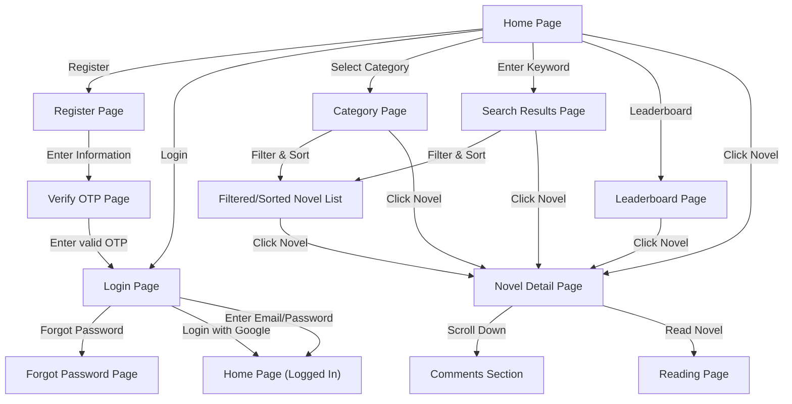
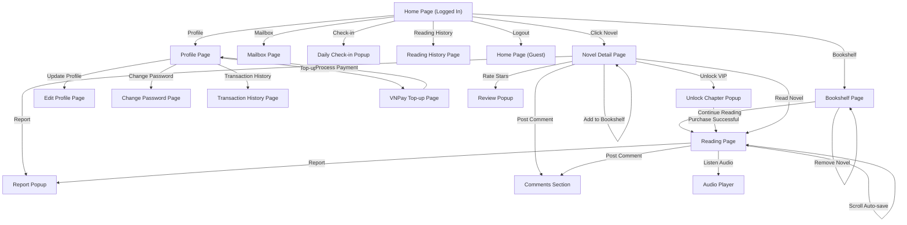
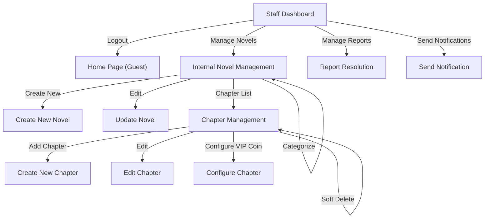
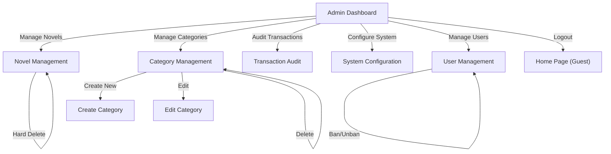

# Screenflow Diagram for each Actor
Based on `danh_sach_chuc_nang.txt` and `phan_quyen_actor.md`, below are the Screenflow diagrams for each Actor in the system.

These diagrams are formatted with standard Mermaid syntax so you can easily copy and paste them directly into **Draw.io** (Menu: Arrange -> Insert -> Advanced -> Mermaid...).

## 1. GUEST

## 2. MEMBER

## 3. STAFF

## 4. ADMIN

